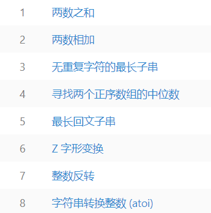

# 一、排版标签

| 标签名          | 定义       | 说明                               |
| --------------- | ---------- | ---------------------------------- |
| `<h1~6></h1~6>` | 标题标签   | 作为标题使用，并且依据重要性递减   |
| `<p></p>`       | 段落标签   | 可以把 HTML 文档分割为若干段落     |
| `<hr />`        | 水平线标签 | 没啥可说的，就是一条线             |
| `<br />`        | 换行标签   |                                    |
| `<div></div>`   | div标签    | 用来布局的，一行只能放一个div      |
| `<span></span>` | span标签   | 用来布局的，一行上可以放好多个span |


# 二、文本格式化标签

| 标签名             | 作用                |
| ------------------ | ------------------- |
| `<b></b>`          | 文本加粗            |
| `<strong><strong>` | 文本加粗+文本强调   |
| `<i></i>`          | 文本倾斜            |
| `<em></em>`        | 文本倾斜+文本强调   |
| `<s></s>`          | 文本删除线          |
| `<del></del>`      | 文本删除线+文本强调 |
| `<u></u>`          | 文本下划线          |
| `<ins></ins>`      | 文本下划线+文本强调 |


# 三、图像标签

**语法：**

```
 
```

**属性：**

| 属性    | 属性值  | 作用                     |
| ------- | ------- | ------------------------ |
| **src** | **URL** | **图像路径**             |
| alt     | 文本    | 图像不能显示时的替换文本 |
| title   | 文本    | 鼠标悬停时的显示内容     |
| width   | 像素、% | 设置图像宽度             |
| height  | 像素、% | 设置图像高度             |
| border  | 数字    | 设置图像边框的宽度       |

# 四、列表标签

## 1. ul 无序列表 

**语法：**

```
 <ul>
   <li>列表项1</li>
   <li>列表项2</li>
   <li>列表项3</li>
   ......
 </ul>
```

**举例：**


**注意：**

- `<ul></ul>`中只能嵌套`<li></li>`，直接在`<ul></ul>`标签中输入其他标签或者文字的做法是不被允许的。
- `<li>`与`</li>`之间相当于一个容器，可以容纳所有元素。
- 由于兼容性问题，一般会把li标签的属性设为`list-style:none`;


## 2. ol 有序列表

**语法：**

```
 <ol>
   <li>列表项1</li>
   <li>列表项2</li>
   <li>列表项3</li>
   ......
 </ol>
```

**举例：**




## 3. dl 自定义列表

**语法：**

```
 <dl>
   <dt>名词1</dt>
   <dd>名词1解释1</dd>
   <dd>名词1解释2</dd>
   ...
   <dt>名词2</dt>
   <dd>名词2解释1</dd>
   <dd>名词2解释2</dd>
   ...
 </dl>
```

**举例：**


# 五、表格标签

**作用：**

展示数据，让数据规整地显示。


## 1. 基础用法

**语法：**

```
 <table>
   <tr>
     <td>1-1</td>
     <td>1-2</td>
   </tr>
   <tr>
     <td>2-1</td>
   </tr>
 </table>
```

**解释：**

- `<table>` 用于定义一个表格标签。
- `<tr>` 用于定义表格中的行，必须在`<table></table>`标签中使用。
- `<td>` 用于定义表格中的单元格，必须在`<tr></tr>`标签中使用。


## 2. 表格属性 

**`<table>`常用属性：**

| 属性        | 属性值            | 作用                                                         |
| ----------- | ----------------- | ------------------------------------------------------------ |
| border      | pixel(默认0px)    | 设置表格边框                                                 |
| cellspacing | pixel(默认2px)    | 设置单元格与单元格边框之间的空白间距（css取消表格间空白间隙：border-collapse:collapse;） |
| cellpadding | pixel(默认1px)    | 设置单元格内容与单元格边框之间的空白间距                     |
| width       | pixel             | 设置表格宽度                                                 |
| height      | pixel             | 设置表格高度                                                 |
| align       | left/center/right | 设置表格在网页中的水平对齐方式                               |


## 3. th 表头标签

**作用：**

一般表头单元格位于表格的第一行或第一列，并且文本加粗居中。

**语法：**

用`<th></th>`替代相应的单元格标签`<td></td>`即可


## 4. caption 表格标题

**作用：**

定义表格标题，通常该标题会被居中显示于表格之上。

**语法：**

```
 <table>
    <caption>我是表格标题</caption>
 </table>
```

**注意：**

- `<caption>`要紧随`<table>`之后。
- 该标签只在表格里使用才有意义。


## 5. 合并单元格

**语法：**

```
 <table>
   <tr>
     <td rowspan="跨行合并单元格的个数">text</td>
     <td colspan="跨列合并单元格的个数">text</td>
   </tr>
 </table>
```
**合并步骤：**

1. 先确定是跨行还是跨列合并。
2. 根据**先上后下、先左后右**的原则找到目标单元格，然后写上合并方式，及要合并的单元格数量，如 ： `<td colspan="3"></td>`。
3. 最后删除多余的单元格。


**举例：**
```
<table>
   <tr>
       <td>1-1</td>
       <td>1-2</td>
       <td>1-3</td>
       <td rowspan="2">1-4</td>
   </tr>
   <tr>
       <td colspan="3">1-1</td>
       <td>2-4</td>
   </tr>
</table>
```


# 六、表单标签

**作用：**

跟用户进行交互，收集用户资料。

**构成：**
1. **表单控件：** 包含了具体的表单功能项，如单行文本输入框、密码输入框、复选框、提交按钮、重置按钮等。
2. **提示信息：** 一个表单中通常还需要包含一些说明性的文字，提示用户进行填写和操作。
3. **表单域：** 表单域相当于一个容器，用来容纳所有的表单控件和提示信息。它可以通过定义表单数据提交到服务器的url地址和方法。如果不定义表单域，表单中的数据就无法传送到后台服务器。


## 1. input 输入框

**语法：**

```
 <input type="属性值" 其它属性="属性值">
```

**常用属性属性：**

- type：用于切换表单控件的类型。

  |  属性值  |        作用        |
  | :------: | :----------------: |
  |   text   |   单行文本输入框   |
  | password |     密码输入框     |
  |  radio   |       单选框       |
  | checkbox |       复选框       |
  |  button  |      普通按钮      |
  |  submit  |      提交按钮      |
  |  reset   |      重置按钮      |
  |  image   | 图像形式的提交按钮 |
  |   file   |       文件域       |
  |  hidden  |       隐藏域       |

- 其它属性

  |     属性     |            属性值             |                作用                 |
  | :----------: | :---------------------------: | :---------------------------------: |
  |     name     |             text              |          控件的名称(分类)           |
  |    value     |             text              |       input控件中的默认文本值       |
  |     size     |              N*               |     input控件在页面中的显示宽度     |
  |   checked    |            checked            |       选择控件默认被选中的项        |
  |  maxlength   |              N*               |      控件允许输入的最多字符数       |
  |   required   |           required            |                必填                 |
  | autocomplete |              off              |     禁止自动填充和记录填写历史      |
  |    accept    | 文件类型(eg. `image/png,...`) | 限制可选文件类型，type="file"时使用 |


## 2. label 标签

**作用：**

当我们鼠标点击 label标签里面的文字时， 光标会定位到指定的表单里面。

**语法：**

-   用法一：label直接包括input表单，适合单个表单选择

    ```
    <label> 用户名： 
        <input type="radio" name="usename" value="请输入用户名">   
    </label>
    ```

-   用法二：for 属性规定 label 与哪个表单元素绑定。

    ```
     <label for="sex">男</label>
     <input type="radio" name="sex"  id="sex">
    ```


## 3. textarea 文本域

**语法：**

```
 <textarea >
   文本内容
 </textarea>
```
**作用：**

创建多行文本输入框。

**属性：**

| 属性 | 属性值 | 作用           |
| ---- | ------ | -------------- |
| rows | num    | 显示的行数     |
| cols | num    | 每行中的字符数 |


**文本框和文本域区别：**

| 表单                | 名称   | 区别             | 默认值显示方式      | 运用场景             |
| ------------------- | ------ | ---------------- | ------------------- | -------------------- |
| `input type="text"` | 文本框 | 只能显示一行文本 | 通过value显示默认值 | 用户名、昵称、密码等 |
| `textarea`          | 文本域 | 可以显示多行文本 | 默认值写到标签中间  | 留言板               |


## 4. select 下拉列表

**语法：**

```
 <select>
   <option>选项1</option>
   <option>选项2</option>
   <option>选项3</option>
   ...
 </select>
```

**举例：**


**注意：**

- `<select>` 中至少包含一对`<option>`
- 在`<option>`中定义`selected="selected"`时，当前项即为默认选中项。


## 5. form 表单域

**语法:**

```
 <form action="url地址" method="提交方式" name="表单名称">
   各种表单控件
 </form>
```

**作用：**

将收集的用户信息提交给服务器。

**属性：**

| 属性   | 属性值   | 作用                                               |
| ------ | -------- | -------------------------------------------------- |
| action | url地址  | 用于指定接收并处理表单数据的服务器程序的url地址。  |
| method | get/post | 用于设置表单数据的提交方式，其取值为get或post。    |
| name   | 名称     | 用于指定表单的名称，以区分同一个页面中的多个表单。 |

**注意:**

-   每个表单都应该有自己表单域。
-   表单中的按钮都有点击后，默认提交标签的行为。


# 七、链接标签

## 1. 基础用法

**语法：**

```
 <a href="跳转目标" target="目标窗口的弹出方式">网页元素</a>
```

| 属性     | 属性值                                         | 作用                          |
| -------- | ---------------------------------------------- | ----------------------------- |
| **href** | **URL**                                        | **用于指定链接目标的url地址** |
| target   | *self：在当前页面打开，* blank：在新窗口打开。 | 用于指定链接页面的打开方式    |

**注意：**


1.  内部链接直接填入内部相对路径即可 比如 `< a href="index.html">首页</a>`
2.  不仅文本可以创建超链接，图像、表格、音频、视频等网页元素都可以添加超链接。
3.  空链接 `href="#"`，点击会跳转到页面顶部。 


## 2. 锚点定位

**作用：**

通过创建锚点链接，用户能够快速定位到目标内容。

**语法：**

(1) 跳转目标：`<标签名 id="idName"></标签名>`

(2) 链接文本：`<a href="#idName"></a>`


# 八、其它常见标签
## 1. base 标签

**语法：**

```
<head>
    <base target="_blank" />
</head>
```

**作用：**

将整体链接的打开状态设为在新标签页打开。


## 2. pre 预格式化文本标签

**作用：**

被包围在 `<pre>` 标签中的文本会保留空格和换行符，且文本也会呈现为等宽字体。

**语法：**

```
<pre>

  此例演示如何使用 pre 标签

  对空行和 空格

  进行控制

</pre>
```


## 3. iframe 标签

**作用：**

-   标记一个内联框架。
-   内联框架可以在当前页面内嵌另一个页面。
-   内联框架可以调用父页面的方法。

**语法：**

```
<iframe name="框架名" src="框架默认显示的页面URL"  frameborder="0"></iframe>
```

```
<!-- 在指定框架中打开跳转页面 -->
<a href="跳转页面URL" target="框架名"></a>
```

```
// 调用父页面的方法
window.parent.父页面方法();
```

**注意：**

-   使用内联框架时，外层要包一个盒子用于规范框架大小。
-   外层盒子要设置`overflow: hidden;`来隐藏自身滚动条，否则容易出现两个滚动条的情况(盒子和框架都有滚动条)。

**举例：**

```
<!-- 导航 -->
<ul>
    <li><a href="/home/dashboard.html" target="fm">首页</a></li>
    <li><a href="list.html" target="fm">列表页</a></li>
</ul>
<!-- 内联框架 -->
<div class="body">
    <iframe name="fm" src="/home/dashboard.html" frameborder="0"></iframe>
</div>
```

```
.body {
    position: fixed;
    top: 60px;
    bottom: 44px;
    /* 隐藏父盒子滚动条 */
    overflow: hidden;
}

iframe {
    width: 100%;
    height: 100%;
}
```

```
window.parent.getUserInfo();
```