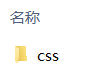
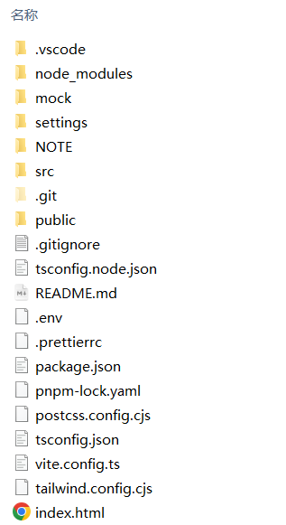

# 一、标签属性

**语法：**

```
 <tag key1="value1" key2="value2" …> 内容 </tag>
```

**举例：**

```
 
```

**注意：**

-   元素属性值使用双引号语法
-   元素属性值可以写上的都写上
-   尽量不使用样式属性，留到CSS写

# 二、注释

**语法：**

```
 <!-- 注释语句 -->     
```


**风格：**

```
 <!-- 1.推荐 -->
 <div>...</div>
 
 <div>...</div><!-- 2.不推荐 -->    
     
 <div><!-- 3.不推荐 -->
     ...
 </div>
```
# 三、路径
实际工作中，为了难快速的找到需要的文件，因此我们需要一个文件夹来管理它们。

**目录：**

就是一个普通文件夹，只不过里面存放了我们制作网页所需要的相关素材，如html文件、图片等等。

（存放css文件的目录)

**项目根目录**

存放项目的文件夹为项目根目录。


（例子中，存放图示所有内容的目录为项目根目录）
## 1. 相对路径

| 路径分类   | 符号  | 说明                                                         |
| ---------- | ----- | ------------------------------------------------------------ |
| 同一级路径 |       | 只需输入图像文件的名称即可，如``。    |
| 下一级路径 | “/”   | 图像文件位于HTML文件同级文件夹下（例如文件夹名称为：images），如``。 |
| 上一级路径 | “../” | 在文件名之前加入“../” ，如果是上两级，则需要使用 “../ ../”，以此类推，如``。 |

## 2. 绝对路径

绝对路径以Web站点根目录为参考基础的目录路径。称为绝对，是因为当所有网页引用同一个文件时，使用的路径都是一样的。

**举例：**
- D:\web\img\logo.png
- http://www.baidu.com/images/logo.png

# 四、特殊字符
**说明：**

在 HTML 中，不能使用`<`、`>`等特殊字符，因为浏览器会将它们作为标签解析。若要正确显示，需要在 HTML 源代码中使用字符实体。

**常见字符实体对照表：**

| 特殊字符 | 描述              | 字符实体   |
| -------- | ----------------- | ---------- |
|          | 空格              | `&nbsp;`   |
| <        | 小于号            | `&lt;`     |
| >        | 大于号            | `&gt;`     |
| &        | 和号              | `&amp;`    |
| "        | 引号              | `&quot; `  |
| '        | 撇号              | `&apos;`   |
| ￠       | 分（cent）        | `&cent;`   |
| £        | 镑（pound）       | `&pound;`  |
| ¥        | 元（yen）         | `&yen;`    |
| €        | 欧元（euro）      | `&euro;`   |
| §        | 小节              | `&sect;`   |
| ©        | 版权（copyright） | `&copy;`   |
| ®        | 注册商标          | `&reg;`    |
| ™        | 商标              | `&trade;`  |
| ×        | 乘号              | `&times;`  |
| ÷        | 除号              | `&divide;` |

**更多：**

<https://www.w3school.com.cn/tags/html_ref_entities.html>

# 五、emmet语法

**作用：**

提高html/css的编写速度。

**快捷操作：**

-   按Tab键：自动补全。

    ```
    <!--输入div，再按Tab键，生成：-->
    <div></div>
    ```

-   `* num`：生成指定数量的标签。

    ```
    <!--输入div*3，再按Tab键，生成：-->
    <div></div>
    <div></div>
    <div></div>
    ```

-   `>`：生成父子级关系的标签。

    ```
    <!--输入ul>li，再按Tab键，生成：-->
    <ul>
        <li></li>
    </ul>
    ```

-   `+`：生成兄弟标签。

    ```
    <!--输入div+p，再按Tab键，生成：-->
    <div></div>
    <p></p>
    ```

-   `[标签名].类名`：生成指定类名的标签。

    ```
    <!--输入.box，再按Tab键，生成：-->
    <div class="box"></div>
    <!--输入p.article，再按Tab键，生成：-->
    <p class="article"></p>
    ```

-   `$`：按顺序生成携带类名的标签。

    ```
    <!--输入.demo$*3，再按Tab键，生成：-->
    <div class="demo1"></div>
    <div class="demo2"></div>
    <div class="demo3"></div>
    ```
    
    
# 六、字符集和字符编码

## 1. charset

**作用：**

让HTML文件是以 UTF-8 编码保存的，浏览器根据编码去解码对应的HTML内容。必写代码，不写可能会造成乱码情况。

**语法：**

```
 <meta charset="UTF-8" />
```


## 2. 字符集

**概念：**

字符集定义了现实中的文字与二进制间的对应关系。它为每个现实文字分配了唯一的编号。

**ASCII字符集：**

-   ASCII字符集包含了英文字符和常见特殊符号。
-   共128(2^7)个字符，实际用7位(Bit)即可存储，但考虑到计算机一般把字节(Byte)作为基本单元，因此用1字节(8Bit)来存储1个ASCII码。这样虽然浪费了1个比特位，但是读写效率提高了。

**Unicode字符集：**

-   Unicode字符集目前已经包含了上百万的字符。
-   位置靠前的Unicode字符用1字节就能存储，位置靠后的Unicode字符要用3字节才能存储。
-   Unicode字符集在制定时没有考虑编码的问题。

> **说明：**
>
> 有的字符集在制定时就考虑到了编码的问题；有的字符集只管制定字符的编号（至于编码，就是其他人的事了）。


## 3. 字符编码

> **参考：**
>
> <https://blog.csdn.net/guxiaonuan/article/details/78678043>

**概念：**

字符编码是将字符集中的文字编号存储到内存中的方案。

**字符编码方案：**

-   方案1：为每个字符分配固定长度的内存。
-   方案2：为每个字符分配可变长度、尽量少的内存。

**Unicode可用的字符编码：**

-   UTF-8：一种变长的编码方案，用 1~6 个字节来存储。
-   UTF-32：一种固定长度的编码方案，不管字符编号大小，始终使用 4 个字节来存储。
-   UTF-16：介于 UTF-8 和 UTF-32 之间，使用 2 个或者 4 个字节来存储，长度既固定又可变。

**UTF-8字符编码：**

UTF-8的编码规则是：如果只有1字节，那么最高的比特位为 0；如果有n字节，那么第1个字节从最高位开始，连续有几个比特位的值为 1，就使用几个字节编码，剩下的字节均以 10 开头。

```
 // x用来存储Unicode中的字符编号
 0xxxxxxx  // 单字节编码形式，这和 ASCII 编码完全一样(UTF-8兼容ASCII)
 110xxxxx 10xxxxxx  // 双字节编码形式
 1110xxxx 10xxxxxx 10xxxxxx  // 三字节编码形式
 11110xxx 10xxxxxx 10xxxxxx 10xxxxxx  // 四字节编码形式
```