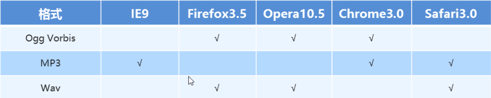
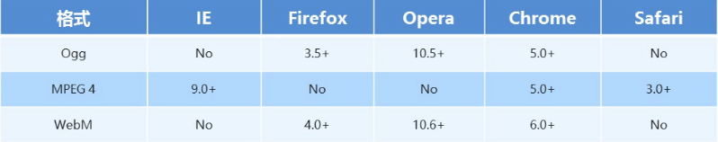

# 一、介绍

**定义：**

-   狭义：定义了 `HTML` 标准的最新版本，是对 `HTML` 的第五次重大修改。该版本定义了新的标签、特性和属性。
-   广义：指一个技术集，该技术集包括： `HTML5` 、`CSS3` 、`javascript`。

**HTML5新增内容：**
-   语义化标签
-   本地存储
-   兼容特性
-   `2D`、`3D`
-   动画、过渡
-   `CSS3` 特性
-   性能与集成

**HTML5现状：**

`HTML5` 已是大势所趋。它的绝大多数新特性，都已经被浏览器所支持，最新版本的浏览器已经开始陆续支持最新的特性。


# 二、新增标签
## 1. 语义化标签

**常用：**

| **标签名** | **语义** |
| ---------- | -------- |
| header     | 头部     |
| nav        | 导航     |
| article    | 内容     |
| section    | 块级     |
| aside      | 侧边栏   |
| footer     | 尾部     |

**举例：**


**作用：**

- 让页面内容结构化，结构清晰，以便于对浏览器、搜索引擎解析，也便于开发和维护。
- 可在无样式 CSS 的情况下，让页面以易读的文档格式显示。
- 便于爬虫确定页面各部分内容的权重，利于SEO。

**注意：**

-   语义化标签主要针对搜索引擎。
-   在 `IE9` 浏览器中，需要把语义化标签都转换为块级元素。
-   语义化标签，在移动端支持比较友好。

## 2. 多媒体标签

### 2.1 audio 音频标签

**作用：**

播放音乐文件。

**基础语法：**

```
<!-- 基础用法 -->
<audio 
    src="media/music.mp3" 
    controls 
    autoplay 
    loop
></audio>
```

| 属性     | 属性值  | 作用             |
| -------- | ------- | ---------------- |
| src      | url     | 音频地址（必写） |
| controls | boolean | 显示音频控件     |
| autoplay | boolean | 自动播放         |
| loop     | boolean | 循环播放         |

**兼容用法：**

因为不同的浏览器支持不同格式的音频，所以一般准备多个不同格式的音频文件

```
 <audio controls="controls">
     <source src="media/music.mp3" type="audio/mpeg" />
     <source src="media/music.ogg" type="audio/ogg" />
 </audio>
```

**注意：**

autoplay 属性在chrome 浏览器中被禁用了。

​    


### 2.2 video 视频标签

**作用：**

播放视频文件。

**基础语法：**

```
 <video src="media/film.mp4" controls></video>
```

| 属性     | 属性值    | 作用                                         |
| -------- | --------- | -------------------------------------------- |
| src      | url       | 音频地址（必写）                             |
| controls | boolean   | 显示视频控件                                 |
| autoplay | boolean   | 自动播放                                     |
| loop     | boolean   | 循环播放                                     |
| width    | pixel     | 设置播放器宽度                               |
| height   | pixel     | 设置播放器高度                               |
| muted    | muted     | 静音播放                                     |
| preload  | auto/none | 是否预先加载视频（如果有autoplay则可以忽略） |

**兼容用法：**

因为不同的浏览器支持不同格式的视频，所以一般准备多个不同格式的视频文件

```
 <video>
     <source src="media/forest.mp4" type="video/mp4">
     <source src="media/forest.ogg" type="video/ogg">
 </video>
```



**注意：**

谷歌浏览器禁用了自动播放音频的功能，因此无法自动播放视频，如果想自动播放，需要添加 muted 属性。


## 3. input标签

**语法：**

```
 <input type="type属性值" 属性="属性值"/>
```

**新增类型：**

| type属性值 | 作用                   |
| ---------- | ---------------------- |
| email      | 限制用户输入为email    |
| url        | 限制用户输入为URL      |
| data       | 限制用户输入为日期     |
| time       | 限制用户输入为时间     |
| month      | 限制用户输入为月份     |
| week       | 限制用户输入为周       |
| number     | 限制用户输入为数字     |
| tel        | 限制用户输入为手机号码 |
| search     | 搜索框                 |
| color      | 生成颜色表单           |

**新增表单属性：**

| 属性          | 属性值    | 作用                                                       |
| ------------- | --------- | ---------------------------------------------------------- |
| required      | required  | 表单必填                                                   |
| placeholder   | 提示文本  | 显示表单提示信息                                           |
| multiple      | multiple  | 可以提交多个文件                                           |
| autofocus     | autofocus | 页面加载完成后自动到该表单                                 |
| autocompelete | off/on    | 是否以列表形式显示该表单成功提交过的信息，需要添加name属性 |